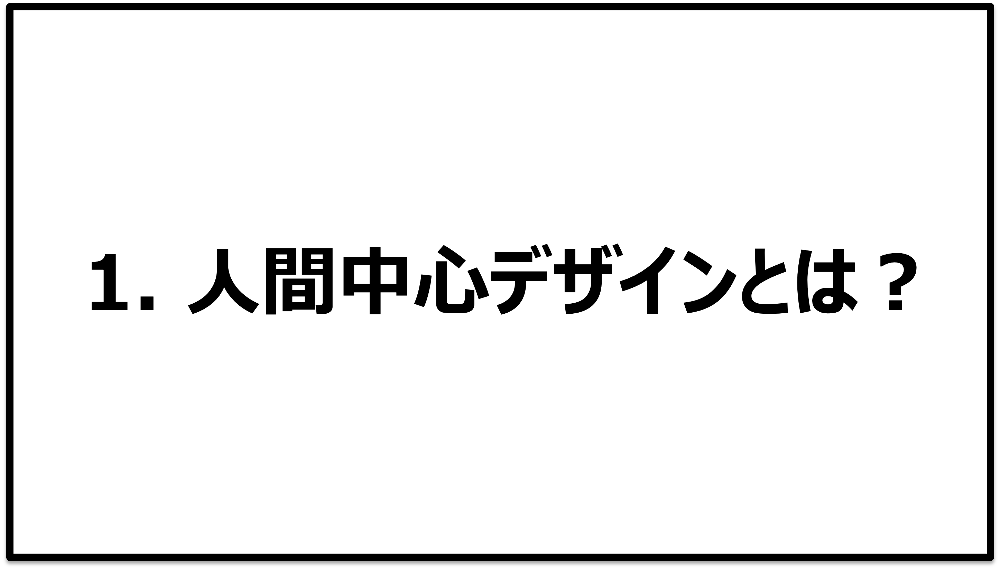

# 人間中心デザインとは？

## 1.人間中心デザインとは？

<a href="1_WhatsHCD.md" target=”_blank”>確認テスト</a>

## 2.計画

<a href="2_Plan.md" target=”_blank”>確認テスト</a>

## 3.要求定義

<a href="3_ReqDef.md" target=”_blank”>確認テスト</a>

## 4.具現化

<a href="https://www.youtube.com/watch?v=VzGbtbPmyaY)

<a href="4_Embodiment.md" target=”_blank”>確認テスト</a>
